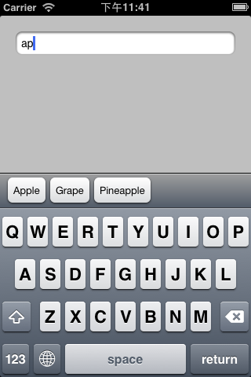

## IGAutoCompletionToolbar

IGAutoCompletionToolbar is a UICollectionView subclass created to display auto completion via a keyboard accessory view.



### Requirements

iOS 7 or above with ARC.

### Installation

If you are using CocoaPods, add 'IGAutoCompletionToolbar' to your Podfile:

```
pod 'IGAutoCompletionToolbar', '~> 0.2.1'
```

Otherwise, download the projects and add files under IGAutoCompletionToolbar/* and 'QuartzCore' framework to your project.

### Usage

Import IGAutoCompletionToolbar from your application:

```
#import "IGAutoCompletionToolbar.h"
```

Then create the toolbar and connect it with the textfield:

```
// Create the toolbar
IGAutoCompletionToolbar* toolbar = [[IGAutoCompletionToolbar alloc] initWithFrame:CGRectMake(0,0,320,44)];

// set auto complete items
toolbar.items = @[@"Apple", @"Banana", @"Blueberry", @"Grape", @"Pineapple", @"Orange", @"Pear"];

// setup the delegate
toolbar.toolbarDelegate = self;

// setup the text field to be used
toolbar.textField = self.textfield;

// set the toolbar as the input accessory view of the textfield
self.textfield.inputAccessoryView = toolbar;
```

### Contact

Francis Chong [[Blog](http://reality.hk), [Twitter](http://twitter.com/siuying)]

### License

IGAutoCompletionToolbar is available under the MIT license. See the LICENSE file for more info.